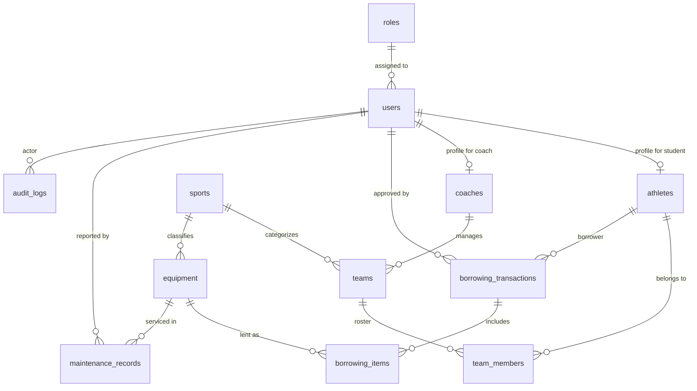

# FALCONSYSTEM: Athletic Equipment Services & Resource Management System
## Advanced Database Systems (IM101) — Comprehensive Project Documentation & Defense Manual

---

## 1. Project Overview
**FalconSystem** is a specialized, 3NF-compliant relational web application developed for collegiate athletic equipment and resource management. Built for the **3rd-Year Advanced Database Systems** curriculum, it demonstrates robust relational database design, server-side MySQL automation (Triggers, Stored Procedures, Stored Functions, and Views), atomic ACID transactions, negative inventory prevention, and Role-Based Access Control (RBAC).

The system is constructed with **PHP 8.2+ / Laravel 11 MVC**, a native **MySQL 8.0 / MariaDB 10.4** database engine, and a clean, responsive **Blade + Bootstrap 5** presentation layer designed specifically for academic presentation and defense.

---

## 2. Objectives
1. Design an entity-relational database architecture strictly adhering to **Third Normal Form (3NF)**.
2. Implement **two required Many-to-Many ($N:M$) relationships** using junction tables containing meaningful intersection attributes.
3. Enforce **database-level referential integrity** using strategic `RESTRICT`, `CASCADE`, and `SET NULL` foreign key constraints.
4. Eliminate concurrency race conditions and **prevent negative inventory** using row-level locking (`SELECT ... FOR UPDATE`) and engine-level triggers.
5. Implement server-side automation through **MySQL Stored Procedures, Functions, and Triggers**.
6. Provide a secure, parameterized backend with **4 distinct Role-Based Access Control (RBAC)** portals: Admin, Staff, Coach, and Student.
7. Ensure seamless cloud database deployment readiness (`.env` database abstraction).

---

## 3. System Scope
FalconSystem manages:
* **Athletes**: Student profile records, student numbers, college departments, and year levels.
* **Coaches**: Coaching staff records, employee IDs, and assigned sports divisions.
* **Sports**: Collegiate sports divisions (e.g., Baseball, Softball, Table Tennis).
* **Teams**: Varsity teams classified by sport and managed by coaches.
* **Team Members**: Many-to-Many membership junction between Teams and Athletes.
* **Equipment**: Athletic equipment inventory, categorization, and physical conditions.
* **Borrowing Transactions**: Equipment checkout and loan records with due dates.
* **Borrowing Items**: Many-to-Many loan junction between Transactions and Equipment items.
* **Maintenance & Damage**: Work orders, physical condition tracking, and repairs.
* **Audit Logs**: Database trigger-generated audit trail of all data manipulations.

---

## 4. User Roles & Clearance Matrix
The system defines exactly **4 distinct roles**:

| Role | Primary User / Account | Clearance & System Responsibility |
| :--- | :--- | :--- |
| **ADMIN** | `admin` (Ma'am Arbe — Athletics Director) | Full system oversight. Manages users, athletes, coaches, sports, teams, equipment master, and maintenance. Inspects trigger audit logs and operational reports. |
| **STAFF** | `staff1` (Custodian John) | Equipment desk operations. Issues borrowing transactions via stored procedure, inspects returns, and tracks maintenance tickets. |
| **COACH** | `coach_baseball`, `coach_softball`, `coach_tabletennis` | Views assigned varsity teams, monitors athlete rosters, submits equipment requests, and reports damaged gear. |
| **STUDENT / ATHLETE** | `athlete_juan`, `athlete_ana`, `athlete_mark` | Browses live equipment catalog, submits borrowing loan requests, tracks own active borrowings/history, and reports gear defects. |

---

## 5. Entity-Relationship Diagram (ERD)



---

## 6. Relational Schema (12 Tables in Strict 3NF)
```text
1.  roles                   (id, name, description, created_at, updated_at)
2.  users                   (id, role_id, username, email, password, status, remember_token, created_at, updated_at)
3.  athletes                (id, user_id, student_number, first_name, last_name, department, year_level, contact_number, status, created_at, updated_at)
4.  coaches                 (id, user_id, employee_number, first_name, last_name, contact_number, status, created_at, updated_at)
5.  sports                  (id, sport_name, description, status, created_at, updated_at)
6.  teams                   (id, sport_id, coach_id, team_name, school_year, status, created_at, updated_at)
7.  team_members            (id, team_id, athlete_id, joined_at, position, status, created_at, updated_at) [N:M Junction 1]
8.  equipment               (id, sport_id, equipment_code, equipment_name, category, quantity, available_quantity, condition, status, created_at, updated_at)
9.  borrowing_transactions  (id, athlete_id, approved_by, borrow_date, expected_return_date, actual_return_date, status, remarks, created_at, updated_at)
10. borrowing_items         (id, borrowing_transaction_id, equipment_id, quantity, condition_before, condition_after, returned_quantity, created_at, updated_at) [N:M Junction 2]
11. maintenance_records     (id, equipment_id, reported_by, maintenance_type, description, scheduled_date, completed_date, status, remarks, created_at, updated_at)
12. audit_logs              (id, user_id, action, table_name, record_id, old_values, new_values, created_at)
```

---

## 7. Data Dictionary

### Table 1: `roles`
| Column | Type | Constraints | Description |
| :--- | :--- | :--- | :--- |
| `id` | BIGINT UNSIGNED | PK, AUTO_INCREMENT | Unique role identifier |
| `name` | VARCHAR(50) | UNIQUE, NOT NULL | Role code (`admin`, `staff`, `coach`, `student`) |
| `description` | VARCHAR(255) | NULLABLE | Role description |

### Table 2: `users`
| Column | Type | Constraints | Description |
| :--- | :--- | :--- | :--- |
| `id` | BIGINT UNSIGNED | PK, AUTO_INCREMENT | User ID |
| `role_id` | BIGINT UNSIGNED | FK -> `roles.id`, RESTRICT | Assigned role |
| `username` | VARCHAR(50) | UNIQUE, NOT NULL | Login username |
| `email` | VARCHAR(100) | UNIQUE, NOT NULL | User email address |
| `password` | VARCHAR(255) | NOT NULL | Bcrypt hashed password |
| `status` | VARCHAR(20) | DEFAULT 'Active' | Account state (`Active`, `Inactive`) |

### Table 3: `athletes`
| Column | Type | Constraints | Description |
| :--- | :--- | :--- | :--- |
| `id` | BIGINT UNSIGNED | PK, AUTO_INCREMENT | Athlete ID |
| `user_id` | BIGINT UNSIGNED | FK -> `users.id`, CASCADE | Parent user login |
| `student_number` | VARCHAR(50) | UNIQUE, NOT NULL | University student ID |
| `first_name` | VARCHAR(100) | NOT NULL | Given name |
| `last_name` | VARCHAR(100) | NOT NULL | Surname |
| `department` | VARCHAR(100) | NOT NULL | College/Department |
| `year_level` | TINYINT UNSIGNED | DEFAULT 1 | College academic year |
| `contact_number` | VARCHAR(30) | NULLABLE | Phone contact |
| `status` | VARCHAR(20) | DEFAULT 'Active' | Student eligibility status |

### Table 4: `coaches`
| Column | Type | Constraints | Description |
| :--- | :--- | :--- | :--- |
| `id` | BIGINT UNSIGNED | PK, AUTO_INCREMENT | Coach ID |
| `user_id` | BIGINT UNSIGNED | FK -> `users.id`, CASCADE | Parent user login |
| `employee_number`| VARCHAR(50) | UNIQUE, NOT NULL | University employee ID |
| `first_name` | VARCHAR(100) | NOT NULL | Given name |
| `last_name` | VARCHAR(100) | NOT NULL | Surname |
| `contact_number` | VARCHAR(30) | NULLABLE | Phone contact |
| `status` | VARCHAR(20) | DEFAULT 'Active' | Staff employment status |

### Table 5: `sports`
| Column | Type | Constraints | Description |
| :--- | :--- | :--- | :--- |
| `id` | BIGINT UNSIGNED | PK, AUTO_INCREMENT | Sport ID |
| `sport_name` | VARCHAR(100) | UNIQUE, NOT NULL | Division name (e.g. Baseball) |
| `description` | TEXT | NULLABLE | Sport details |
| `status` | VARCHAR(20) | DEFAULT 'Active' | Division status |

### Table 6: `teams`
| Column | Type | Constraints | Description |
| :--- | :--- | :--- | :--- |
| `id` | BIGINT UNSIGNED | PK, AUTO_INCREMENT | Team ID |
| `sport_id` | BIGINT UNSIGNED | FK -> `sports.id`, RESTRICT | Classified sport |
| `coach_id` | BIGINT UNSIGNED | FK -> `coaches.id`, SET NULL | Assigned head coach |
| `team_name` | VARCHAR(100) | NOT NULL | Team name |
| `school_year` | VARCHAR(20) | DEFAULT '2026-2027' | Competition academic year |
| `status` | VARCHAR(20) | DEFAULT 'Active' | Team status |

### Table 7: `team_members` (N:M Junction 1)
| Column | Type | Constraints | Description |
| :--- | :--- | :--- | :--- |
| `id` | BIGINT UNSIGNED | PK, AUTO_INCREMENT | Junction ID |
| `team_id` | BIGINT UNSIGNED | FK -> `teams.id`, CASCADE | Team reference |
| `athlete_id` | BIGINT UNSIGNED | FK -> `athletes.id`, CASCADE | Athlete reference |
| `joined_at` | DATE | NOT NULL | Date enrolled in team |
| `position` | VARCHAR(50) | NULLABLE | Player position (e.g. Pitcher) |
| `status` | VARCHAR(20) | DEFAULT 'Active' | Roster membership status |

### Table 8: `equipment`
| Column | Type | Constraints | Description |
| :--- | :--- | :--- | :--- |
| `id` | BIGINT UNSIGNED | PK, AUTO_INCREMENT | Equipment ID |
| `sport_id` | BIGINT UNSIGNED | FK -> `sports.id`, RESTRICT | Sport reference |
| `equipment_code` | VARCHAR(50) | UNIQUE, NOT NULL | Asset tracking code |
| `equipment_name` | VARCHAR(150) | NOT NULL | Equipment title/model |
| `category` | VARCHAR(100) | NOT NULL | Type (Bats, Gloves, Balls) |
| `quantity` | INT UNSIGNED | DEFAULT 0 | Total inventory owned |
| `available_quantity`| INT | DEFAULT 0 | Inventory on hand |
| `condition` | VARCHAR(50) | DEFAULT 'Good' | Physical condition |
| `status` | VARCHAR(30) | DEFAULT 'Available' | Operational status |

### Table 9: `borrowing_transactions`
| Column | Type | Constraints | Description |
| :--- | :--- | :--- | :--- |
| `id` | BIGINT UNSIGNED | PK, AUTO_INCREMENT | Transaction ID |
| `athlete_id` | BIGINT UNSIGNED | FK -> `athletes.id`, RESTRICT | Borrowing student |
| `approved_by` | BIGINT UNSIGNED | FK -> `users.id`, SET NULL | Staff/Admin approver |
| `borrow_date` | DATE | NOT NULL | Checkout date |
| `expected_return_date`| DATE | NOT NULL | Loan deadline |
| `actual_return_date` | DATE | NULLABLE | Completion date |
| `status` | VARCHAR(30) | DEFAULT 'Pending' | Loan state (`Borrowed`, `Returned`) |
| `remarks` | TEXT | NULLABLE | Purpose/Notes |

### Table 10: `borrowing_items` (N:M Junction 2)
| Column | Type | Constraints | Description |
| :--- | :--- | :--- | :--- |
| `id` | BIGINT UNSIGNED | PK, AUTO_INCREMENT | Item junction ID |
| `borrowing_transaction_id`| BIGINT UNSIGNED | FK -> `borrowing_transactions.id`, CASCADE | Transaction reference |
| `equipment_id` | BIGINT UNSIGNED | FK -> `equipment.id`, RESTRICT | Equipment reference |
| `quantity` | INT UNSIGNED | DEFAULT 1 | Borrowed units |
| `condition_before` | VARCHAR(50) | DEFAULT 'Good' | Condition at checkout |
| `condition_after` | VARCHAR(50) | NULLABLE | Condition on return |
| `returned_quantity`| INT UNSIGNED | DEFAULT 0 | Units verified returned |

### Table 11: `maintenance_records`
| Column | Type | Constraints | Description |
| :--- | :--- | :--- | :--- |
| `id` | BIGINT UNSIGNED | PK, AUTO_INCREMENT | Maintenance record ID |
| `equipment_id` | BIGINT UNSIGNED | FK -> `equipment.id`, RESTRICT | Serviced equipment |
| `reported_by` | BIGINT UNSIGNED | FK -> `users.id`, SET NULL | Reporter user |
| `maintenance_type` | VARCHAR(80) | NOT NULL | Type (Repair, Restring) |
| `description` | TEXT | NOT NULL | Work order description |
| `scheduled_date` | DATE | NOT NULL | Scheduled start date |
| `completed_date` | DATE | NULLABLE | Completion date |
| `status` | VARCHAR(30) | DEFAULT 'Scheduled' | Order status |
| `remarks` | TEXT | NULLABLE | Technician notes |

### Table 12: `audit_logs`
| Column | Type | Constraints | Description |
| :--- | :--- | :--- | :--- |
| `id` | BIGINT UNSIGNED | PK, AUTO_INCREMENT | Audit entry ID |
| `user_id` | BIGINT UNSIGNED | FK -> `users.id`, SET NULL | Actor user ID |
| `action` | VARCHAR(50) | NOT NULL | Action (`INSERT`, `UPDATE`, `DELETE`) |
| `table_name` | VARCHAR(50) | NOT NULL | Affected database table |
| `record_id` | BIGINT UNSIGNED | NULLABLE | Affected primary key |
| `old_values` | JSON | NULLABLE | Previous record state |
| `new_values` | JSON | NULLABLE | New record state |
| `created_at` | TIMESTAMP | DEFAULT CURRENT_TIMESTAMP | Engine timestamp |

---

## 8. Third Normal Form (3NF) Justification

### First Normal Form (1NF)
* **Atomicity**: Every column contains single, indivisible scalar values (e.g. `first_name` and `last_name` are separated, dates are atomic `DATE` types).
* **No Repeating Groups**: Rather than storing multiple equipment items or athletes in comma-separated strings inside a single row, separate junction tables (`team_members`, `borrowing_items`) are employed.

### Second Normal Form (2NF)
* The database is in 1NF.
* **Full Functional Dependency**: Every non-key attribute depends on the entirety of the primary key. In the junction tables (`team_members`, `borrowing_items`), intersection attributes (such as `position` and `joined_at` in `team_members`, or `condition_before` and `returned_quantity` in `borrowing_items`) depend on both joined foreign keys, eliminating partial key dependencies.

### Third Normal Form (3NF)
* The database is in 2NF.
* **No Transitive Dependencies**: Non-key attributes depend *only* on candidate keys and never on other non-key attributes.
  * For example, athlete profile information (`student_number`, `department`, `year_level`) is not duplicated across borrowing transactions; borrowing transactions reference only `athlete_id`.
  * Sport descriptions are not copied into the `equipment` or `teams` tables; they reference `sport_id`.
  * Physical equipment conditions and available quantities reside purely in `equipment`.

---

## 9. Relationships & Referential Integrity
* `users.role_id` $\rightarrow$ `roles.id`: `ON DELETE RESTRICT` (Protects master system roles from deletion).
* `athletes.user_id` $\rightarrow$ `users.id`: `ON DELETE CASCADE` (Removing user removes linked athlete profile).
* `coaches.user_id` $\rightarrow$ `users.id`: `ON DELETE CASCADE` (Removing user removes linked coach profile).
* `teams.sport_id` $\rightarrow$ `sports.id`: `ON DELETE RESTRICT` (Sports with teams cannot be inadvertently dropped).
* `teams.coach_id` $\rightarrow$ `coaches.id`: `ON DELETE SET NULL` (Coach changes do not destroy varsity teams).
* `team_members.team_id` $\rightarrow$ `teams.id`: `ON DELETE CASCADE` (Disbanding team clears roster).
* `team_members.athlete_id` $\rightarrow$ `athletes.id`: `ON DELETE CASCADE` (Removing student drops memberships).
* `equipment.sport_id` $\rightarrow$ `sports.id`: `ON DELETE RESTRICT` (Sports division cannot be deleted while equipment exists).
* `borrowing_transactions.athlete_id` $\rightarrow$ `athletes.id`: `ON DELETE RESTRICT` (Historical borrower records are preserved).
* `borrowing_items.borrowing_transaction_id` $\rightarrow$ `borrowing_transactions.id`: `ON DELETE CASCADE`.
* `borrowing_items.equipment_id` $\rightarrow$ `equipment.id`: `ON DELETE RESTRICT` (Equipment with transaction history cannot be deleted).
* `maintenance_records.equipment_id` $\rightarrow$ `equipment.id`: `ON DELETE RESTRICT`.

---

## 10. Database Triggers (5 Automated Triggers)
All triggers reside in `database/sql/database_automation.sql`:

1. **`trg_audit_equipment_insert`** (`AFTER INSERT ON equipment`):
   Automatically captures new equipment creations and writes JSON snapshots of new attributes to `audit_logs`.
2. **`trg_audit_equipment_update`** (`AFTER UPDATE ON equipment`):
   Captures delta updates (changes to `available_quantity`, `condition`, `status`) and writes before/after JSON states to `audit_logs`.
3. **`trg_audit_equipment_delete`** (`AFTER DELETE ON equipment`):
   Logs deleted equipment codes, quantities, and names into `audit_logs`.
4. **`trg_borrowing_items_insert_inventory`** (`BEFORE INSERT ON borrowing_items`):
   *Checks live availability*:
   ```sql
   IF v_current_avail < NEW.quantity THEN
       SIGNAL SQLSTATE '45000'
       SET MESSAGE_TEXT = 'Negative inventory violation: Requested quantity exceeds available inventory.';
   ELSE
       UPDATE equipment SET available_quantity = available_quantity - NEW.quantity WHERE id = NEW.equipment_id;
   END IF;
   ```
5. **`trg_borrowing_items_return_inventory`** (`AFTER UPDATE ON borrowing_items`):
   When `NEW.returned_quantity > OLD.returned_quantity`, automatically increments `equipment.available_quantity` by the returned delta.

---

## 11. Stored Procedures (3 Core Procedures)

### 1. `sp_process_borrowing`
* **Signature**: `(IN p_athlete_id, IN p_equipment_id, IN p_quantity, IN p_expected_return_date, IN p_approved_by, IN p_remarks, OUT p_success, OUT p_message, OUT p_transaction_id)`
* **Atomic Workflow**:
  1. Validates athlete is Active.
  2. Executes `START TRANSACTION`.
  3. Executes `SELECT available_quantity INTO v_avail FROM equipment WHERE id = p_equipment_id FOR UPDATE` (Row Lock).
  4. If `v_avail < p_quantity`, triggers `ROLLBACK` and sets `p_success = FALSE`.
  5. Inserts `borrowing_transactions` and `borrowing_items`.
  6. Trigger decrements inventory safely.
  7. Inserts transaction log into `audit_logs`.
  8. Executes `COMMIT` and sets `p_success = TRUE`.

### 2. `sp_process_return`
* **Signature**: `(IN p_borrowing_item_id, IN p_returned_qty, IN p_condition_after, IN p_processed_by, OUT p_success, OUT p_message)`
* **Atomic Workflow**:
  1. Validates item existence and return quantity bounds.
  2. Executes `START TRANSACTION`.
  3. Locks borrowing item (`FOR UPDATE`).
  4. Increments `returned_quantity` and sets `condition_after`.
  5. Trigger increments `equipment.available_quantity`.
  6. If all items in transaction are returned, flags `borrowing_transactions.status = 'Returned'`.
  7. Commits transaction and writes audit log.

### 3. `sp_get_overdue_equipment`
* **Signature**: `()`
* Produces an analytical result set joining overdue borrowers, student numbers, phone contacts, equipment details, expected return dates, and overdue days calculated via `fn_overdue_days`.

---

## 12. Stored Functions (2 Functions)

### 1. `fn_overdue_days(p_expected_date DATE, p_actual_date DATE) RETURNS INT`
Calculates deterministic elapsed days past the deadline:
* If `p_actual_date` is provided and exceeds `p_expected_date`, calculates `DATEDIFF(p_actual_date, p_expected_date)`.
* If unreturned and `CURRENT_DATE() > p_expected_date`, calculates `DATEDIFF(CURRENT_DATE(), p_expected_date)`.
* Otherwise returns 0.

### 2. `fn_equipment_availability(p_equipment_id BIGINT) RETURNS VARCHAR(50)`
Evaluates real-time availability string:
* Returns `'Out of Stock'` if `available_quantity <= 0`.
* Returns `'Low Stock'` if `available_quantity <= 2`.
* Returns `'Available'` if stock is healthy.
* Returns current condition if flagged for maintenance.

---

## 13. Database Views (3 Core Views)
1. **`vw_equipment_inventory`**:
   Comprehensive equipment catalog joined with `sports`, showing total quantity, available quantity, in-use quantity, condition, and stock status function output.
2. **`vw_current_borrowings`**:
   Real-time view of all loans in `Borrowed`, `Pending`, or `Approved` states joined with student athlete contact information and return due dates.
3. **`vw_overdue_borrowings`**:
   Filter of active unreturned equipment exceeding deadline, calculating dynamic overdue days.

---

## 14. Indexes & Performance Optimization
Strategic B-Tree indexes added to frequently filtered and joined columns:
* `users.email` (Unique lookups)
* `athletes.student_number` (Unique search & joins)
* `coaches.employee_number` (Unique search & joins)
* `equipment.equipment_code` (Asset scans)
* `equipment.sport_id` (Foreign key joins)
* `equipment.status` (Availability filtering)
* `equipment.category` (Category searches)
* `equipment.(sport_id, status)` (Composite index for inventory lookups)
* `borrowing_transactions.athlete_id` (Borrower history joins)
* `borrowing_transactions.status` (Loan filtering)
* `borrowing_transactions.expected_return_date` (Overdue scanning)
* `borrowing_transactions.(status, expected_return_date)` (Composite index for overdue reports)
* `borrowing_items.borrowing_transaction_id` & `borrowing_items.equipment_id` (Junction table joins)
* `maintenance_records.equipment_id` & `maintenance_records.status`
* `audit_logs.created_at` & `audit_logs.table_name` (Audit log timeline filtering)

---

## 15. Transaction Management & Negative Inventory Prevention
* **Row-Level Locking**: `SELECT ... FOR UPDATE` acquires an exclusive lock on the specific equipment record until the transaction completes.
* **Deterministic Isolation**: Concurrent requests attempting to borrow the same last item are serialized. The first transaction commits and decrements stock to 0; the second transaction reads the locked row, observes `available_quantity == 0`, rolls back, and returns:
  `"Insufficient inventory: Only 0 available, but 1 requested."`
* **Engine-Level Trigger Guard**: `trg_borrowing_items_insert_inventory` throws a `SQLSTATE '45000'` signal if an attempt is made to bypass application logic and insert a quantity exceeding available stock.

---

## 16. Role-Based Access Control (RBAC) Implementation
* Enforced at the HTTP kernel routing level via `App\Http\Middleware\RoleMiddleware`.
* Route groups enforce role clearance:
  * `/admin/*`: Accessible exclusively by `admin`.
  * `/staff/*`: Accessible by `staff`.
  * `/coach/*`: Accessible by `coach`.
  * `/student/*`: Accessible by `student`.
* Unauthorized attempts return an **HTTP 403 Forbidden** response.

---

## 17. Security & Parameterized Database Access
* **No Root Credentials in Production**: Application database access is restricted to the dedicated least-privileged user `falcon_app`.
* **100% Prepared Statements**: Eloquent ORM and `DB::statement("CALL ... (?, ?)")` utilize parameterized PDO binding, completely eliminating SQL Injection vulnerabilities.
* **Bcrypt Password Hashing**: Passwords are never stored in plaintext (`Hash::make(...)`).
* **CSRF Protection**: All web forms include `@csrf` token validation.

---

## 18. Automated Defense Testing Suite
Execute the automated test suite directly via:
```bash
php artisan test:defense
```
Results: **16 PASSED, 0 FAILED**
* **Test 1**: Create equipment master record, check initial available quantity, and verify MySQL Trigger `trg_audit_equipment_insert`.
* **Test 2**: Process equipment checkout via `sp_process_borrowing`, verifying atomic transaction and available quantity decrement.
* **Test 3**: Attempt over-borrowing beyond available stock; verify automatic rollback and descriptive error response.
* **Test 4**: Process return via `sp_process_return`, verifying inventory restoration.
* **Test 5**: Concurrency & zero-inventory protection test (second concurrent borrower rejected; stock remains valid at 0).
* **Test 6**: RBAC verification (student attempting admin route receives HTTP 403 Forbidden).

---

## 19. Query Optimization & EXPLAIN Documentation

### Query 1: Current Borrowings by Status and Expected Return Date
```sql
EXPLAIN SELECT 
    bt.id, a.student_number, CONCAT(a.first_name, ' ', a.last_name) AS borrower_name,
    e.equipment_code, e.equipment_name, bi.quantity, bt.borrow_date, bt.expected_return_date
FROM borrowing_transactions bt
JOIN athletes a ON bt.athlete_id = a.id
JOIN borrowing_items bi ON bt.id = bi.borrowing_transaction_id
JOIN equipment e ON bi.equipment_id = e.id
WHERE bt.status = 'Borrowed'
  AND bt.expected_return_date >= CURRENT_DATE();
```
* **Query Plan Analysis**:
  * `bt`: Uses `PRIMARY` and index `borrowing_transactions_status_expected_return_date_index`.
  * `e`: `eq_ref` lookup via `PRIMARY` key (`id`).
  * `a`: `eq_ref` lookup via `PRIMARY` key (`id`).

### Query 2: Overdue Equipment Loans
```sql
EXPLAIN SELECT 
    bt.id, a.student_number, e.equipment_name, bi.quantity,
    bt.borrow_date, bt.expected_return_date,
    DATEDIFF(CURRENT_DATE(), bt.expected_return_date) AS days_overdue
FROM borrowing_transactions bt
JOIN athletes a ON bt.athlete_id = a.id
JOIN borrowing_items bi ON bt.id = bi.borrowing_transaction_id
JOIN equipment e ON bi.equipment_id = e.id
WHERE bt.status = 'Borrowed'
  AND bt.expected_return_date < CURRENT_DATE()
  AND (bi.quantity - bi.returned_quantity) > 0;
```
* **Optimization Document**:
  * Utilizes composite B-Tree index `borrowing_transactions_status_expected_return_date_index` (`ref` type, `Using index condition`).
  * `bi`: Uses foreign key index `borrowing_items_borrowing_transaction_id_index`.

---

## 20. Cloud Database Deployment Guide
For course evaluation requiring a cloud-hosted relational database (rejecting localhost in production):

1. **Provision a Free Cloud MySQL Instance**:
   * Providers: **Aiven for MySQL**, **Clever Cloud**, or **AWS RDS Free Tier**.
2. **Retrieve Connection Parameters**:
   * Host (e.g. `mysql-falcon-production.aivencloud.com`)
   * Port (e.g. `15234` or `3306`)
   * Database Name (`falcon_system`)
   * Username (`falcon_app` or cloud user)
   * Password
3. **Configure `.env`**:
   ```ini
   DB_CONNECTION=mysql
   DB_HOST=mysql-falcon-production.aivencloud.com
   DB_PORT=15234
   DB_DATABASE=falcon_system
   DB_USERNAME=falcon_app
   DB_PASSWORD=YourSecureCloudPassword123!
   ```
4. **Deploy Schema, Seeders & Automation**:
   ```bash
   php artisan migrate --force
   php artisan db:seed --force
   php artisan db:automation
   ```
5. **Verify Cloud Health**:
   ```bash
   php artisan test:defense
   ```
