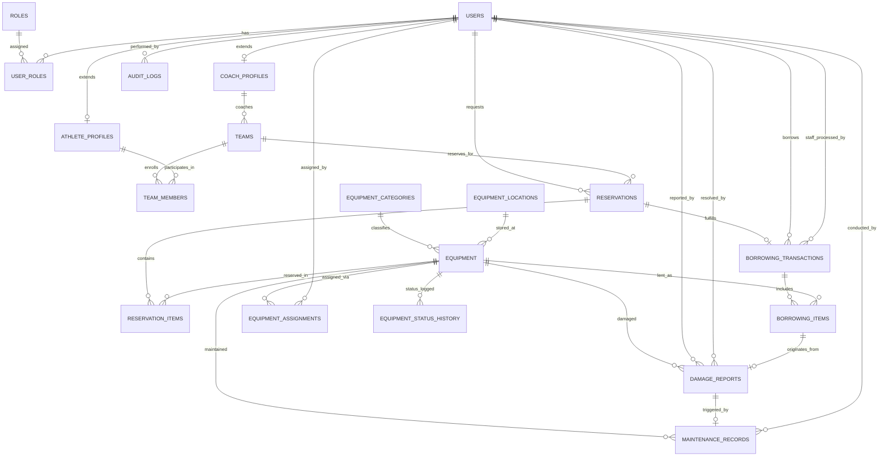

# FalconSystem: Athletic Equipment Services & Resource Management System
## Master Architecture, Database Specification (3NF), and Implementation Plan

FalconSystem is an enterprise-grade athletic equipment management and resource planning web application designed for collegiate athletic departments, sports organizations, and teams. Built for an **Advanced Database Systems** curriculum, it demonstrates strict Third Normal Form (3NF) relational design, server-side automation (MySQL Stored Procedures, Functions, Triggers, and Audit Logging), atomic transactions, strict Role-Based Access Control (RBAC), and a clean Laravel MVC + Service Layer architecture.

---

## 1. System Architecture

FalconSystem uses a multi-tier decoupled architecture ensuring strict separation of concerns across presentation, business logic, data access, and database-level enforcement:

```
[ Browser / Client ]
      │ (HTML5, Vanilla CSS3, Vanilla JS, Responsive Blade UI)
      ▼
[ Web Routing & Security Layer ]
      │ (CSRF Protection, Authenticate, RoleMiddleware, Permission Gates)
      ▼
[ Controllers & Form Requests ]
      │ (HTTP handling, Input Validation, Response formatting)
      ▼
[ Application Service Layer ]
      │ (BorrowingService, ReservationService, MaintenanceService, AuditService)
      ▼
[ Eloquent ORM & DB Transactions ]
      │ (Prepared statements, Relationships, Atomic DB::transaction boundaries)
      ▼
[ MySQL 8.0 Engine (InnoDB) ]
      ├── Relational Tables (18 Normalized 3NF Tables, Strict FK Constraints)
      ├── Stored Procedures (Atomic checkout & return workflows)
      ├── Stored Functions (Equipment availability & reservation overlap check)
      ├── Database Triggers (Automatic audit logging, severe damage status sync)
      └── Strategic Indexes (B-Tree composite indexes on statuses & search vectors)
```

---

## 2. Complete Entity-Relationship Diagram (ERD)



---

## 3. Normalized Database Schema (18 Tables)

### Table 1: `roles`
Stores authorization roles.
* `id`: `BIGINT UNSIGNED AUTO_INCREMENT PRIMARY KEY`
* `name`: `VARCHAR(50) NOT NULL UNIQUE` (e.g., `admin`, `staff`, `coach`, `athlete`)
* `display_name`: `VARCHAR(100) NOT NULL`
* `description`: `VARCHAR(255) NULL`
* `created_at`: `TIMESTAMP NULL`
* `updated_at`: `TIMESTAMP NULL`

### Table 2: `users`
Base authentication entity.
* `id`: `BIGINT UNSIGNED AUTO_INCREMENT PRIMARY KEY`
* `username`: `VARCHAR(50) NOT NULL UNIQUE`
* `email`: `VARCHAR(100) NOT NULL UNIQUE`
* `password`: `VARCHAR(255) NOT NULL`
* `first_name`: `VARCHAR(60) NOT NULL`
* `last_name`: `VARCHAR(60) NOT NULL`
* `phone`: `VARCHAR(20) NULL`
* `is_active`: `BOOLEAN NOT NULL DEFAULT TRUE`
* `remember_token`: `VARCHAR(100) NULL`
* `created_at`: `TIMESTAMP NULL`
* `updated_at`: `TIMESTAMP NULL`

### Table 3: `user_roles` (N:M Junction: Users ↔ Roles)
* `id`: `BIGINT UNSIGNED AUTO_INCREMENT PRIMARY KEY`
* `user_id`: `BIGINT UNSIGNED NOT NULL` (`FK -> users.id ON DELETE CASCADE`)
* `role_id`: `BIGINT UNSIGNED NOT NULL` (`FK -> roles.id ON DELETE CASCADE`)
* `is_primary`: `BOOLEAN NOT NULL DEFAULT FALSE`
* `assigned_at`: `TIMESTAMP NOT NULL DEFAULT CURRENT_TIMESTAMP`
* `UNIQUE KEY (user_id, role_id)`

### Table 4: `athlete_profiles` (1:1 Extension of `users`)
Separates sports profile attributes from core user credentials.
* `id`: `BIGINT UNSIGNED AUTO_INCREMENT PRIMARY KEY`
* `user_id`: `BIGINT UNSIGNED NOT NULL UNIQUE` (`FK -> users.id ON DELETE CASCADE`)
* `student_id`: `VARCHAR(30) NOT NULL UNIQUE`
* `emergency_contact_name`: `VARCHAR(100) NOT NULL`
* `emergency_contact_phone`: `VARCHAR(20) NOT NULL`
* `medical_clearance_status`: `ENUM('Cleared', 'Pending', 'Restricted') NOT NULL DEFAULT 'Pending'`
* `year_level`: `TINYINT UNSIGNED NOT NULL`
* `created_at`: `TIMESTAMP NULL`
* `updated_at`: `TIMESTAMP NULL`

### Table 5: `coach_profiles` (1:1 Extension of `users`)
* `id`: `BIGINT UNSIGNED AUTO_INCREMENT PRIMARY KEY`
* `user_id`: `BIGINT UNSIGNED NOT NULL UNIQUE` (`FK -> users.id ON DELETE CASCADE`)
* `employee_id`: `VARCHAR(30) NOT NULL UNIQUE`
* `specialization`: `VARCHAR(100) NOT NULL`
* `department`: `VARCHAR(100) NOT NULL`
* `license_number`: `VARCHAR(50) NULL`
* `created_at`: `TIMESTAMP NULL`
* `updated_at`: `TIMESTAMP NULL`

### Table 6: `teams`
* `id`: `BIGINT UNSIGNED AUTO_INCREMENT PRIMARY KEY`
* `name`: `VARCHAR(100) NOT NULL UNIQUE`
* `sport`: `VARCHAR(60) NOT NULL`
* `coach_id`: `BIGINT UNSIGNED NOT NULL` (`FK -> coach_profiles.id ON DELETE RESTRICT`)
* `gender_category`: `ENUM('Men', 'Women', 'Co-ed') NOT NULL`
* `status`: `ENUM('Active', 'Inactive', 'Offseason') NOT NULL DEFAULT 'Active'`
* `created_at`: `TIMESTAMP NULL`
* `updated_at`: `TIMESTAMP NULL`

### Table 7: `team_members` (N:M Junction: Teams ↔ Athlete Profiles)
Meaningful intersection attributes for team rosters.
* `id`: `BIGINT UNSIGNED AUTO_INCREMENT PRIMARY KEY`
* `team_id`: `BIGINT UNSIGNED NOT NULL` (`FK -> teams.id ON DELETE CASCADE`)
* `athlete_id`: `BIGINT UNSIGNED NOT NULL` (`FK -> athlete_profiles.id ON DELETE CASCADE`)
* `jersey_number`: `VARCHAR(10) NULL`
* `position`: `VARCHAR(50) NULL`
* `membership_status`: `ENUM('Active', 'Injured', 'Suspended', 'Former') NOT NULL DEFAULT 'Active'`
* `joined_at`: `DATE NOT NULL`
* `left_at`: `DATE NULL`
* `UNIQUE KEY (team_id, athlete_id, membership_status)`

### Table 8: `equipment_categories`
* `id`: `BIGINT UNSIGNED AUTO_INCREMENT PRIMARY KEY`
* `name`: `VARCHAR(80) NOT NULL UNIQUE`
* `code`: `VARCHAR(20) NOT NULL UNIQUE` (e.g., `BBALL`, `VBALL`, `PROT`, `FITN`)
* `description`: `VARCHAR(255) NULL`
* `created_at`: `TIMESTAMP NULL`
* `updated_at`: `TIMESTAMP NULL`

### Table 9: `equipment_locations`
* `id`: `BIGINT UNSIGNED AUTO_INCREMENT PRIMARY KEY`
* `building`: `VARCHAR(100) NOT NULL`
* `room`: `VARCHAR(50) NOT NULL`
* `shelf_bin`: `VARCHAR(50) NULL`
* `description`: `VARCHAR(255) NULL`
* `UNIQUE KEY (building, room, shelf_bin)`

### Table 10: `equipment`
Individual tracked assets with strict inventory integrity.
* `id`: `BIGINT UNSIGNED AUTO_INCREMENT PRIMARY KEY`
* `asset_code`: `VARCHAR(50) NOT NULL UNIQUE` (e.g., `EQ-BBALL-001`)
* `name`: `VARCHAR(120) NOT NULL`
* `category_id`: `BIGINT UNSIGNED NOT NULL` (`FK -> equipment_categories.id ON DELETE RESTRICT`)
* `location_id`: `BIGINT UNSIGNED NOT NULL` (`FK -> equipment_locations.id ON DELETE RESTRICT`)
* `serial_number`: `VARCHAR(100) NULL UNIQUE`
* `brand`: `VARCHAR(80) NULL`
* `model`: `VARCHAR(80) NULL`
* `purchase_date`: `DATE NOT NULL`
* `purchase_cost`: `DECIMAL(10,2) NOT NULL CHECK (purchase_cost >= 0)`
* `current_condition`: `ENUM('New', 'Excellent', 'Good', 'Fair', 'Poor') NOT NULL DEFAULT 'Good'`
* `status`: `ENUM('Available', 'Reserved', 'Borrowed', 'Assigned', 'Maintenance', 'Damaged', 'Lost', 'Retired') NOT NULL DEFAULT 'Available'`
* `description`: `TEXT NULL`
* `created_at`: `TIMESTAMP NULL`
* `updated_at`: `TIMESTAMP NULL`

### Table 11: `reservations`
Reservation headers.
* `id`: `BIGINT UNSIGNED AUTO_INCREMENT PRIMARY KEY`
* `reservation_code`: `VARCHAR(30) NOT NULL UNIQUE`
* `requester_id`: `BIGINT UNSIGNED NOT NULL` (`FK -> users.id ON DELETE RESTRICT`)
* `team_id`: `BIGINT UNSIGNED NULL` (`FK -> teams.id ON DELETE SET NULL`)
* `start_time`: `DATETIME NOT NULL`
* `end_time`: `DATETIME NOT NULL`
* `purpose`: `TEXT NOT NULL`
* `status`: `ENUM('Pending', 'Approved', 'Rejected', 'Cancelled', 'Completed') NOT NULL DEFAULT 'Pending'`
* `reviewed_by`: `BIGINT UNSIGNED NULL` (`FK -> users.id ON DELETE SET NULL`)
* `reviewed_at`: `DATETIME NULL`
* `review_notes`: `TEXT NULL`
* `created_at`: `TIMESTAMP NULL`
* `updated_at`: `TIMESTAMP NULL`

### Table 12: `reservation_items` (N:M Junction: Reservations ↔ Equipment)
* `id`: `BIGINT UNSIGNED AUTO_INCREMENT PRIMARY KEY`
* `reservation_id`: `BIGINT UNSIGNED NOT NULL` (`FK -> reservations.id ON DELETE CASCADE`)
* `equipment_id`: `BIGINT UNSIGNED NOT NULL` (`FK -> equipment.id ON DELETE RESTRICT`)
* `requested_quantity`: `INT UNSIGNED NOT NULL DEFAULT 1`
* `approved_quantity`: `INT UNSIGNED NOT NULL DEFAULT 0`
* `item_status`: `ENUM('Pending', 'Approved', 'Unavailable', 'Cancelled') NOT NULL DEFAULT 'Pending'`
* `notes`: `VARCHAR(255) NULL`
* `UNIQUE KEY (reservation_id, equipment_id)`

### Table 13: `borrowing_transactions`
Checkout and custody tracking header.
* `id`: `BIGINT UNSIGNED AUTO_INCREMENT PRIMARY KEY`
* `transaction_code`: `VARCHAR(30) NOT NULL UNIQUE`
* `reservation_id`: `BIGINT UNSIGNED NULL` (`FK -> reservations.id ON DELETE SET NULL`)
* `borrower_id`: `BIGINT UNSIGNED NOT NULL` (`FK -> users.id ON DELETE RESTRICT`)
* `team_id`: `BIGINT UNSIGNED NULL` (`FK -> teams.id ON DELETE SET NULL`)
* `processed_by`: `BIGINT UNSIGNED NOT NULL` (`FK -> users.id ON DELETE RESTRICT`)
* `checkout_time`: `DATETIME NOT NULL`
* `expected_return_time`: `DATETIME NOT NULL`
* `actual_return_time`: `DATETIME NULL`
* `status`: `ENUM('Active', 'Completed', 'Overdue', 'Defaulted') NOT NULL DEFAULT 'Active'`
* `notes`: `TEXT NULL`
* `created_at`: `TIMESTAMP NULL`
* `updated_at`: `TIMESTAMP NULL`

### Table 14: `borrowing_items` (N:M Junction: BorrowingTransactions ↔ Equipment)
Meaningful intersection attributes capturing equipment condition transitions.
* `id`: `BIGINT UNSIGNED AUTO_INCREMENT PRIMARY KEY`
* `transaction_id`: `BIGINT UNSIGNED NOT NULL` (`FK -> borrowing_transactions.id ON DELETE CASCADE`)
* `equipment_id`: `BIGINT UNSIGNED NOT NULL` (`FK -> equipment.id ON DELETE RESTRICT`)
* `checkout_condition`: `ENUM('New', 'Excellent', 'Good', 'Fair', 'Poor') NOT NULL`
* `return_condition`: `ENUM('New', 'Excellent', 'Good', 'Fair', 'Poor') NULL`
* `return_inspected_by`: `BIGINT UNSIGNED NULL` (`FK -> users.id ON DELETE SET NULL`)
* `returned_at`: `DATETIME NULL`
* `status`: `ENUM('Borrowed', 'Returned', 'Damaged', 'Lost') NOT NULL DEFAULT 'Borrowed'`
* `remarks`: `VARCHAR(255) NULL`
* `UNIQUE KEY (transaction_id, equipment_id)`

### Table 15: `equipment_assignments`
Long-term direct equipment assignment to specific athletes or teams.
* `id`: `BIGINT UNSIGNED AUTO_INCREMENT PRIMARY KEY`
* `equipment_id`: `BIGINT UNSIGNED NOT NULL` (`FK -> equipment.id ON DELETE RESTRICT`)
* `assignable_type`: `ENUM('Athlete', 'Team') NOT NULL`
* `athlete_id`: `BIGINT UNSIGNED NULL` (`FK -> athlete_profiles.id ON DELETE CASCADE`)
* `team_id`: `BIGINT UNSIGNED NULL` (`FK -> teams.id ON DELETE CASCADE`)
* `assigned_by`: `BIGINT UNSIGNED NOT NULL` (`FK -> users.id ON DELETE RESTRICT`)
* `assigned_date`: `DATE NOT NULL`
* `expected_end_date`: `DATE NOT NULL`
* `actual_return_date`: `DATE NULL`
* `assignment_status`: `ENUM('Active', 'Returned', 'Revoked') NOT NULL DEFAULT 'Active'`
* `condition_on_assignment`: `ENUM('New', 'Excellent', 'Good', 'Fair', 'Poor') NOT NULL`
* `condition_on_return`: `ENUM('New', 'Excellent', 'Good', 'Fair', 'Poor') NULL`
* `notes`: `TEXT NULL`

### Table 16: `damage_reports`
* `id`: `BIGINT UNSIGNED AUTO_INCREMENT PRIMARY KEY`
* `report_code`: `VARCHAR(30) NOT NULL UNIQUE`
* `equipment_id`: `BIGINT UNSIGNED NOT NULL` (`FK -> equipment.id ON DELETE RESTRICT`)
* `borrowing_item_id`: `BIGINT UNSIGNED NULL` (`FK -> borrowing_items.id ON DELETE SET NULL`)
* `reported_by`: `BIGINT UNSIGNED NOT NULL` (`FK -> users.id ON DELETE RESTRICT`)
* `damage_type`: `VARCHAR(80) NOT NULL` (e.g., `Structural Tear`, `Puncture`, `Bent Frame`, `Missing Part`)
* `severity`: `ENUM('Minor', 'Moderate', 'Severe') NOT NULL`
* `description`: `TEXT NOT NULL`
* `reported_at`: `DATETIME NOT NULL DEFAULT CURRENT_TIMESTAMP`
* `status`: `ENUM('Reported', 'Under Review', 'Repair Required', 'Resolved', 'Closed') NOT NULL DEFAULT 'Reported'`
* `resolution`: `TEXT NULL`
* `resolved_by`: `BIGINT UNSIGNED NULL` (`FK -> users.id ON DELETE SET NULL`)
* `resolved_at`: `DATETIME NULL`

### Table 17: `maintenance_records`
* `id`: `BIGINT UNSIGNED AUTO_INCREMENT PRIMARY KEY`
* `equipment_id`: `BIGINT UNSIGNED NOT NULL` (`FK -> equipment.id ON DELETE RESTRICT`)
* `damage_report_id`: `BIGINT UNSIGNED NULL` (`FK -> damage_reports.id ON DELETE SET NULL`)
* `maintenance_type`: `VARCHAR(80) NOT NULL` (e.g., `Preventative Inspection`, `Patch & Stitch`, `Recalibration`, `Component Replacement`)
* `scheduled_date`: `DATE NOT NULL`
* `start_date`: `DATE NULL`
* `completion_date`: `DATE NULL`
* `assigned_staff_id`: `BIGINT UNSIGNED NOT NULL` (`FK -> users.id ON DELETE RESTRICT`)
* `cost`: `DECIMAL(10,2) NOT NULL DEFAULT 0.00 CHECK (cost >= 0)`
* `status`: `ENUM('Scheduled', 'In Progress', 'Completed', 'Cancelled') NOT NULL DEFAULT 'Scheduled'`
* `description`: `TEXT NOT NULL`
* `result_notes`: `TEXT NULL`
* `created_at`: `TIMESTAMP NULL`
* `updated_at`: `TIMESTAMP NULL`

### Table 18: `equipment_status_history` & `audit_logs`
* `equipment_status_history`:
  * `id`: `BIGINT UNSIGNED AUTO_INCREMENT PRIMARY KEY`
  * `equipment_id`: `BIGINT UNSIGNED NOT NULL` (`FK -> equipment.id ON DELETE CASCADE`)
  * `old_status`: `VARCHAR(50) NOT NULL`
  * `new_status`: `VARCHAR(50) NOT NULL`
  * `changed_by`: `BIGINT UNSIGNED NULL` (`FK -> users.id ON DELETE SET NULL`)
  * `reason`: `VARCHAR(255) NULL`
  * `created_at`: `TIMESTAMP NOT NULL DEFAULT CURRENT_TIMESTAMP`
* `audit_logs` (Database-level audit trail populated by triggers/procedures):
  * `id`: `BIGINT UNSIGNED AUTO_INCREMENT PRIMARY KEY`
  * `user_id`: `BIGINT UNSIGNED NULL` (`FK -> users.id ON DELETE SET NULL`)
  * `action`: `ENUM('INSERT', 'UPDATE', 'DELETE') NOT NULL`
  * `table_name`: `VARCHAR(60) NOT NULL`
  * `record_id`: `BIGINT UNSIGNED NOT NULL`
  * `old_values`: `JSON NULL`
  * `new_values`: `JSON NULL`
  * `ip_address`: `VARCHAR(45) NULL`
  * `user_agent`: `VARCHAR(255) NULL`
  * `created_at`: `TIMESTAMP NOT NULL DEFAULT CURRENT_TIMESTAMP`

---

## 4. 3NF Normalization Proof

1. **First Normal Form (1NF)**:
   * Every attribute contains only atomic, indivisible values (no comma-separated lists of sports, equipment IDs, or dates).
   * Every table has a clearly defined Primary Key.
   * Repeating groups are factored out into junction tables (`team_members`, `reservation_items`, `borrowing_items`).

2. **Second Normal Form (2NF)**:
   * All tables satisfy 1NF.
   * In composite-key/junction tables (`team_members`, `reservation_items`, `borrowing_items`), every non-key attribute depends strictly on the entire composite primary/unique key, not a partial key. For instance, in `borrowing_items`, `return_condition` belongs to that specific piece of equipment within that specific borrowing transaction.

3. **Third Normal Form (3NF)**:
   * All tables satisfy 2NF.
   * No transitive functional dependencies exist ($X \to Y \to Z$).
   * Categories and locations are separated into `equipment_categories` and `equipment_locations`; the `equipment` table stores only `category_id` and `location_id`.
   * Athlete sports data is factored into `athlete_profiles` rather than contaminating the `users` table.
   * Status histories and audits are decoupled into dedicated audit relations rather than maintaining volatile snapshot attributes.

---

## 5. Required Many-to-Many Relationships

FalconSystem implements **three** core N:M relationships with dedicated junction tables featuring rich intersection attributes:

1. **`teams` ↔ `athlete_profiles` (via `team_members`)**:
   * *Intersection Attributes*: `jersey_number`, `position`, `membership_status`, `joined_at`, `left_at`.
2. **`reservations` ↔ `equipment` (via `reservation_items`)**:
   * *Intersection Attributes*: `requested_quantity`, `approved_quantity`, `item_status`, `notes`.
3. **`borrowing_transactions` ↔ `equipment` (via `borrowing_items`)**:
   * *Intersection Attributes*: `checkout_condition`, `return_condition`, `return_inspected_by`, `returned_at`, `status`, `remarks`.

---

## 6. Stored Procedures and Functions

### Stored Function 1: `fn_is_equipment_available`
Evaluates whether a specific equipment unit is eligible for borrowing or reservation over a date window:
```sql
CREATE FUNCTION fn_is_equipment_available(
    p_equipment_id BIGINT UNSIGNED,
    p_start_time DATETIME,
    p_end_time DATETIME
) RETURNS BOOLEAN
DETERMINISTIC
READS SQL DATA
BEGIN
    DECLARE v_status VARCHAR(50);
    DECLARE v_conflict_count INT;

    SELECT status INTO v_status FROM equipment WHERE id = p_equipment_id;
    IF v_status NOT IN ('Available', 'Reserved') THEN
        RETURN FALSE;
    END IF;

    -- Check overlapping approved reservations
    SELECT COUNT(*) INTO v_conflict_count
    FROM reservation_items ri
    JOIN reservations r ON ri.reservation_id = r.id
    WHERE ri.equipment_id = p_equipment_id
      AND ri.item_status = 'Approved'
      AND r.status = 'Approved'
      AND (
          (p_start_time BETWEEN r.start_time AND r.end_time) OR
          (p_end_time BETWEEN r.start_time AND r.end_time) OR
          (r.start_time BETWEEN p_start_time AND p_end_time)
      );

    IF v_conflict_count > 0 THEN
        RETURN FALSE;
    END IF;

    RETURN TRUE;
END;
```

### Stored Procedure 1: `sp_process_checkout`
Executes atomic checkout with availability checks, transaction creation, item binding, and status synchronization:
```sql
CREATE PROCEDURE sp_process_checkout(
    IN p_borrower_id BIGINT UNSIGNED,
    IN p_staff_id BIGINT UNSIGNED,
    IN p_reservation_id BIGINT UNSIGNED,
    IN p_team_id BIGINT UNSIGNED,
    IN p_expected_return DATETIME,
    IN p_equipment_ids JSON,
    IN p_notes TEXT,
    OUT p_transaction_id BIGINT UNSIGNED,
    OUT p_status_code VARCHAR(20),
    OUT p_message VARCHAR(255)
)
BEGIN
    DECLARE EXIT HANDLER FOR SQLEXCEPTION
    BEGIN
        ROLLBACK;
        SET p_status_code = 'ERR_SQL';
        SET p_message = 'Database error occurred during checkout. Transaction rolled back.';
    END;

    START TRANSACTION;
    -- 1. Validate borrower is active
    -- 2. Validate all JSON equipment IDs are available
    -- 3. Create borrowing_transactions record
    -- 4. Create borrowing_items records with checkout condition
    -- 5. Update equipment.status = 'Borrowed'
    -- 6. Update reservation status to Completed if linked
    COMMIT;
END;
```

### Stored Procedure 2: `sp_process_return`
Handles item return inspection, condition updates, damage detection, and status updates atomically.

---

## 7. Database Triggers

1. **`trg_equipment_status_history`** (`AFTER UPDATE ON equipment`):
   * Fires whenever `OLD.status <> NEW.status`.
   * Inserts an entry into `equipment_status_history` capturing old and new status with timestamp.
2. **`trg_damage_severe_equipment_status`** (`AFTER INSERT ON damage_reports`):
   * When `NEW.severity = 'Severe'`, automatically sets `equipment.status = 'Damaged'` and creates a status history record.
3. **`trg_maintenance_status_sync`** (`AFTER UPDATE ON maintenance_records`):
   * When `NEW.status = 'In Progress'`, sets `equipment.status = 'Maintenance'`.
   * When `NEW.status = 'Completed'`, restores `equipment.status = 'Available'`.
4. **`trg_equipment_audit_update`** (`AFTER UPDATE ON equipment`):
   * Captures `JSON_OBJECT` of changed columns and logs directly to `audit_logs`.

---

## 8. Strategic Database Indexes

* `idx_equipment_status_cat`: Composite `(status, category_id)` on `equipment` for high-frequency inventory browsing.
* `idx_equipment_asset_code`: Unique B-Tree on `equipment.asset_code` for barcode/code lookups.
* `idx_borrowing_status_expected`: Composite `(status, expected_return_time)` on `borrowing_transactions` for instant overdue scanning.
* `idx_res_dates_status`: Composite `(start_time, end_time, status)` on `reservations` for collision checks.
* `idx_audit_table_record_time`: Composite `(table_name, record_id, created_at)` on `audit_logs` for entity audit retrieval.

---

## 9. RBAC Architecture and Permissions

| Module | Administrator | Equipment Staff | Coach | Athlete |
| :--- | :---: | :---: | :---: | :---: |
| **System Dashboard** | Full System Metrics | Operational Metrics | Team Metrics | Personal Metrics |
| **User & Role Management** | Full CRUD | No Access | No Access | No Access |
| **Equipment Inventory** | Full CRUD | Add/Edit/View | View Available | View Available |
| **Reservations** | Full Management | Review / Approve | Request for Team | Request for Self |
| **Checkout & Returns** | Full Management | Process Checkout / Returns | View Team Loans | View My Loans |
| **Equipment Assignment** | Full Management | Assign Equipment | View Team Assignments | View My Assignments |
| **Damage Reporting** | Manage & Resolve | Review & Resolve | Report for Team | Report Damaged Item |
| **Maintenance Records** | Full Management | Schedule & Conduct | No Access | No Access |
| **Audit Logs** | Full Access | No Access | No Access | No Access |
| **System Reports** | Full Analytical Reports | Operational Reports | Team Reports | Personal History |

---

## 10. Laravel Folder Architecture

```text
falcon-system/
├── app/
│   ├── Http/
│   │   ├── Controllers/
│   │   │   ├── Auth/ (Login, Profile, Password)
│   │   │   ├── Admin/ (Dashboard, Users, Roles, Categories, Locations, Audits, Settings)
│   │   │   ├── Staff/ (Dashboard, Equipment, Checkouts, Returns, Maintenance, Overdue)
│   │   │   ├── Coach/ (Dashboard, MyTeams, TeamRoster, TeamRequests, TeamAssignments)
│   │   │   └── Athlete/ (Dashboard, Catalog, MyRequests, MyLoans, ReportDamage)
│   │   ├── Middleware/
│   │   │   ├── RoleMiddleware.php
│   │   │   └── CheckAccountActive.php
│   │   └── Requests/ (FormRequest validation classes for all mutations)
│   ├── Models/ (18 Eloquent Models with explicit relationships & scopes)
│   ├── Services/ (BorrowingService, ReservationService, MaintenanceService, AuditService)
│   └── Policies/ (EquipmentPolicy, ReservationPolicy, BorrowingPolicy, DamageReportPolicy)
├── database/
│   ├── migrations/ (Clean ordered 3NF schema migrations)
│   ├── seeders/ (Realistic sports seeders: 4 roles, 15+ equipment, 4 teams, 12 athletes)
│   └── sql/ (Stored procedures, functions, triggers, and views raw DDL)
├── resources/
│   ├── views/
│   │   ├── layouts/ (app, auth, admin, staff, coach, athlete)
│   │   ├── components/ (sidebar, topbar, status-badge, stat-card, modal, data-table)
│   │   ├── admin/, staff/, coach/, athlete/
│   ├── css/ (Modern institutional athletic theme - Deep Navy, Slate, Cyan accents)
│   └── js/ (Interactive modals, search/filter handlers, chart renderers)
└── routes/
    └── web.php (Grouped by role with middleware enforcement)
```

---

## 11. Complete 13-Phase Development Roadmap

* **Phase 1: Project Initialization & Environment Setup**
  * Initialize Laravel project with Git repository and initial commit.
  * Configure environment (`.env`) for local MySQL (`MySQL80` / XAMPP) with secure credentials.
  * Implement base layout, CSS design system (Navy/Cyan athletic institutional identity), and vanilla JS utilities.
  * Build secure authentication (Login, Profile, Change Password, Logout).

* **Phase 2: Database Architecture & Models**
  * Generate 18 migrations matching 3NF design with strict foreign keys, cascade rules, and check constraints.
  * Create Eloquent models with relationship methods (`hasMany`, `belongsTo`, `belongsToMany`).
  * Populate realistic seed data (Admin, 2 Staff, 2 Coaches, 10 Athletes, 4 Teams, 20+ Sports equipment assets).

* **Phase 3: RBAC & Core Layouts**
  * Implement `RoleMiddleware`, Gates, and Policies.
  * Build role-specific sidebar navigation and topbars for Admin, Staff, Coach, and Athlete.

* **Phase 4: Equipment Inventory Module**
  * Category and location management.
  * Equipment catalog with advanced multi-parameter filtering (category, status, condition, location, keyword search).
  * Equipment detail pages with lifecycle timeline.

* **Phase 5: Reservation Workflow**
  * Coach & Athlete reservation request forms with date conflict detection.
  * Staff review queue (Approve, Reject with notes).

* **Phase 6: Borrowing & Checkout System**
  * Checkout processing for approved reservations and walk-in requests.
  * Return processing with inspection condition recording.
  * Overdue tracking logic and automated visual warnings.

* **Phase 7: Equipment Assignment Module**
  * Long-term team and athlete assignment management.
  * Assignment history and return workflows.

* **Phase 8: Damage & Maintenance Management**
  * Damage reporting with severity classification.
  * Maintenance scheduling, staff assignment, cost tracking, and equipment status updates.

* **Phase 9: Database Automation (Triggers, Stored Procedures, Functions)**
  * Deploy `sp_process_checkout` and `sp_process_return`.
  * Deploy `fn_is_equipment_available`.
  * Deploy audit and status change triggers (`trg_equipment_status_history`, `trg_damage_severe_equipment_status`, `trg_equipment_audit_update`).

* **Phase 10: Reports & Analytics**
  * Dynamic relational reports: Equipment Usage, Damage Summary, Maintenance Cost, Overdue Borrowings, and Real-time Inventory Distribution.

* **Phase 11: Database Optimization & Indexing**
  * Apply strategic B-Tree indexes.
  * Verify `EXPLAIN` execution plans for complex queries.

* **Phase 12: Defense Preparation & Documentation**
  * Generate complete Database Dictionary and technical flow documentation.
  * Verify end-to-end user request pipeline: Route -> Middleware -> Controller -> Service -> Model -> Database -> Trigger -> Audit Log.

* **Phase 13: Deployment Readiness**
  * Config caching, restricted DB user setup, and final smoke testing.

---

## Verification Plan

### Automated Verification
* Run database migrations and seeders: `php artisan migrate:fresh --seed`.
* Execute PHPUnit tests for policies, models, and service layer transactions: `php artisan test`.
* Validate database triggers and procedures via SQL test suite scripts.

### Manual Verification
* Log in as each role (`admin`, `staff`, `coach`, `athlete`) and verify route protection (e.g., ensure athletes cannot navigate to `/admin/users` or `/staff/checkout`).
* Execute complete equipment lifecycle: Athlete requests reservation -> Staff approves -> Staff checks out -> Athlete returns with condition change -> Damage report recorded -> Trigger sets equipment to Damaged -> Staff schedules Maintenance -> Maintenance completed -> Trigger resets equipment to Available.
* Verify audit logs and status history entries generated directly by database triggers.
